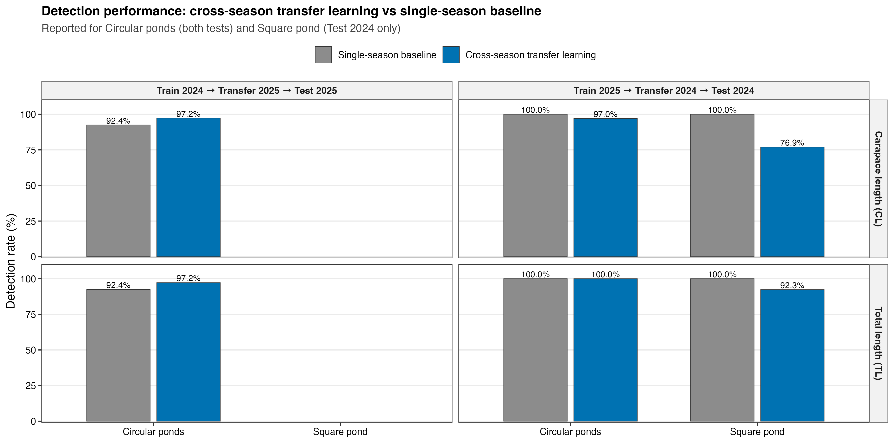
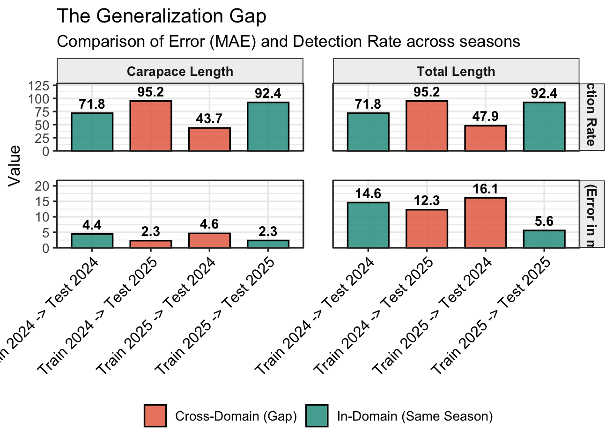

# Fixed-Budget Cross-Season Adaptation for Robotic Morphometric Monitoring of *Macrobrachium rosenbergii*

**Tair Carmon, Eliahu D. Aflalo, Amir Sagi, Yael Edan**  
Ben-Gurion University of the Negev · Achva Academic College

---

## Overview

Seasonal domain shift is a major challenge for robotic morphometric monitoring in commercial aquaculture. Models trained in one production season often degrade when deployed in subsequent seasons due to changes in illumination, turbidity, acquisition protocols, and pose variability.

This repository contains the code and experiments for our fixed-budget cross-season adaptation framework for a mobile, keypoint-based morphometric monitoring system for the giant freshwater prawn *Macrobrachium rosenbergii*, operating in commercial recirculating aquaculture systems (RAS).


---

## Key Findings

- **Seasonal transfer is directionally asymmetric**: deployment from Season 2024 (S24) → Season 2025 (S25) remains stable, but the reverse direction (S25→S24) exhibits severe detection collapse, with detection rates dropping below **62%** without adaptation.
- **Primary failure mode is localization instability**, not regression drift — missed detections remove individuals entirely from the measurement pipeline.
- Under a fixed budget of **K = 200** annotated images, the proposed geometry-aware approach significantly reduces morphometric error and stabilizes performance, achieving results comparable to full transfer with **over 90% reduction in annotation effort**.

---

## Method

### Problem Setting

Two body measurements are estimated from predicted anatomical keypoints (rostrum tip, eye base, carapace posterior edge, telson):
- **Carapace Length (CL)**: carapace posterior edge → eye base
- **Total Length (TL)**: rostrum → telson

Pixel distances are converted to millimeters via refraction-aware camera calibration. The model is YOLOv11n-Pose, trained and evaluated on fixed held-out test sets.

### Framework

The fixed-budget adaptation pipeline has two components:

**1. Geometry-Aware Sample Selection**  
Rather than random sampling, target-season images are selected using a fused representation combining appearance embeddings with interpretable geometric descriptors:
- Carapace–rostrum length (anatomical scale)
- Carapace–rostrum orientation (global body heading)
- Internal bend angle (body curvature)

The annotation set S is built from three complementary criteria:
- **40% uncertainty sampling** — highest keypoint prediction uncertainty
- **40% morphological deviation** — largest deviation from mean carapace–rostrum length
- **20% diversity sampling** — Farthest Point Sampling (FPS) in fused embedding space

**2. Staged Fine-Tuning**  
A three-stage progressive unfreezing schedule balances representational stability and plasticity:
- Stage 1 (30 epochs, freeze=20): adapts high-level representations while preserving low-level geometry
- Stage 2 (40 epochs, freeze=15): gradually increases adaptation capacity
- Stage 3 (10 epochs, freeze=0): full fine-tuning for final target distribution alignment

---

## Results

| Method | Direction | Det. CL (%) | Det. TL (%) | MAE_CL (mm) | MAE_TL (mm) |
|--------|-----------|-------------|-------------|-------------|-------------|
| No Adaptation | S24→S25 | 95.17 | 95.17 | 2.30 | 12.30 |
| Full Transfer | S24→S25 | 96.55 | 96.55 | 2.31 | 5.42 |
| Random (200) | S24→S25 | 94.71 | 94.71 | 2.68 | 5.72 |
| **Geometry-Aware (200)** | **S24→S25** | **91.03** | **91.03** | **2.67** | **6.84** |
| No Adaptation | S25→S24 | 61.86 | 67.52 | 4.56 | 16.01 |
| Full Transfer | S25→S24 | 91.85 | 92.96 | 4.86 | 15.62 |
| Random (200) | S25→S24 | 90.91 | 100.00 | 4.96 | 14.66 |
| **Geometry-Aware (200)** | **S25→S24** | **95.09** | **100.00** | **4.78** | **12.70** |

Geometry-aware selection at K=200 **outperforms full transfer** in the challenging S25→S24 direction while using only ~8% of the full training set.




---

## Repository Structure

```
data-centric-cross-season-transfer/
│
├── scripts/
│   ├── training_tl_models/          # B1, B2, B3 training scripts (freeze-depth grid)
│   │   ├── run_B1_feature_extraction.py
│   │   ├── run_B2_staged_finetune_GRID.py
│   │   └── run_B3_final_training.py
│   │
│   ├── eval/                        # Evaluation on S24 and S25 test sets
│   │   ├── check_on_2024.py
│   │   ├── check_on_2025.py
│   │   └── print_final_results.py
│   │
│   ├── representation_analysis/     # DINO embeddings + UMAP visualization
│   │   ├── extract_dino_embeddings_full_2024_2025.py
│   │   ├── visualize_dino_umap_2024_2025.py
│   │   ├── compute_knn_density.py
│   │   └── core_set_selection/      # Geometry-aware subset builders
│   │
│   ├── shift_experiments/           # Distribution shift quantification
│   │   ├── analyze_shift_unified.py
│   │   ├── visualize_shift_space.py
│   │   └── build_shifted_core_datasets.py
│   │
│   ├── active_season_adaptive_uncertainty_pipeline/
│   │   ├── run_k_sensitivity_experiment.py   # Budget sensitivity (K=50–800)
│   │   ├── run_active_uncertainty_transfer.py
│   │   └── run_adaptive_shift_pipeline.py
│   │
│   ├── analysis/                    # Morphology variance, geometric analysis
│   ├── season_shift_analysis/       # Season-level domain gap characterization
│   ├── plots_for_paper/             # Figure generation scripts
│   ├── preprocess/                  # Data preprocessing utilities
│   └── R_scripts/                   # Statistical analysis
│
├── figs/                            # Paper figures and result plots
├── outputs/                         # Evaluation outputs (CSV, JSON)
├── adaptive_k_experiment/           # K-sensitivity experiment model runs
├── eval_k_sensitivity_results/      # K-sensitivity aggregated results
├── run_all_k_evaluations.py         # Sweeps eval across all K models
├── final_Excel.xlsx                 # Final aggregated results table
│
├── data/          (gitignored)      # Raw images + ImageJ annotations
├── datasets/      (gitignored)      # YOLO-format train/val datasets
└── models/        (gitignored)      # Trained model weights (.pt)
    ├── 2024/                        # S24 native models
    ├── 2025/                        # S25 native models
    └── TF/                          # Cross-season transfer models
```

---

## Getting Started

### Requirements

```bash
pip install ultralytics torch torchvision
pip install umap-learn scikit-learn pandas openpyxl matplotlib seaborn
```

### Training

```bash
# B1: Feature extraction grid (freeze depth × data fraction)
python scripts/training_tl_models/run_B1_feature_extraction.py

# B2: Staged fine-tuning grid
python scripts/training_tl_models/run_B2_staged_finetune_GRID.py

# B3: Final production models (freeze=8, full data)
python scripts/training_tl_models/run_B3_final_training.py
```

### Evaluation

```bash
# Evaluate on S25 test set
python scripts/eval/check_on_2025.py --model <path/to/model.pt>

# Run K-sensitivity sweep across all adaptive-k models
python run_all_k_evaluations.py \
  --eval-script scripts/eval/check_on_2025.py \
  --model-arg --model
```

### Representation Analysis

```bash
# Extract DINO embeddings and visualize seasonal gap
python scripts/representation_analysis/extract_dino_embeddings_full_2024_2025.py
python scripts/representation_analysis/visualize_dino_umap_2024_2025.py
```

---

## Dataset

Data is not included in this repository (gitignored). The dataset comprises:
- **Season 2024 (S24)**: 2,508 annotated images across 3 ponds (2 circular, 1 rectangular)
- **Season 2025 (S25)**: 1,199 annotated images

Each image is annotated with 4 anatomical keypoints: rostrum tip, eye base, carapace posterior edge, and telson. Ground-truth length measurements were collected independently using ImageJ from calibrated underwater recordings.

Expected structure under `data/`:
```
data/
├── images/
├── excel/
├── kp_eval_2024_original/
└── kp_eval_2025_gamma/
```
